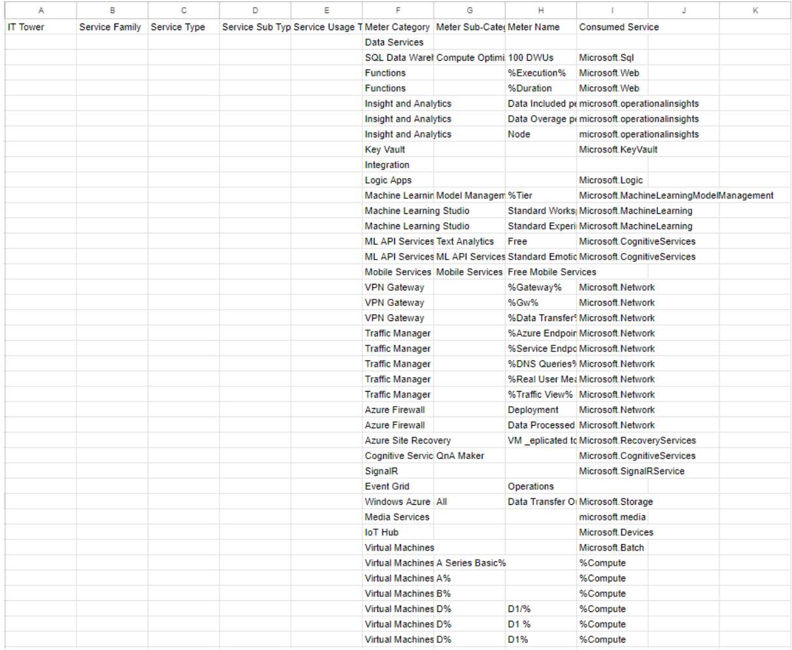
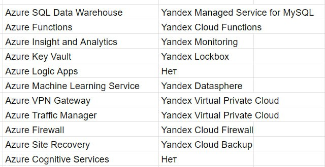
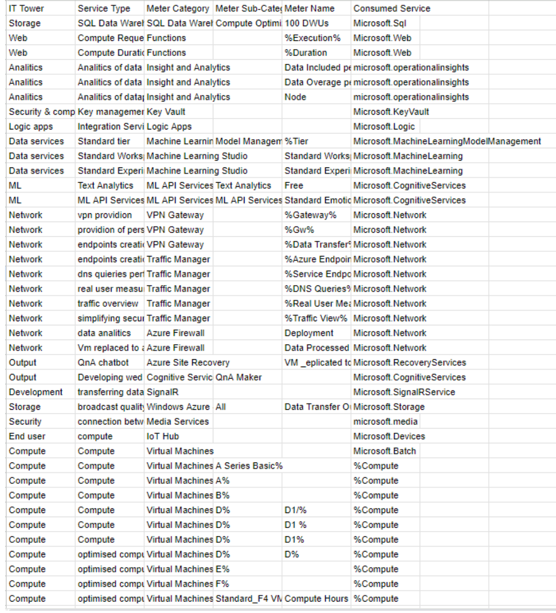

## Аналитическое задание 2 (Вариант 3)
### Команда:
Степанов Кирилл Денисович К3221 413474 (Капитан)
Жерков Даниил 

### Цель работы:
Знакомство с облачными сервисами. Понимание уровней абстракции над инфраструктурой в облаке. Формирование понимания типов потребления сервисов в сервисной-модели. Сопоставление сервисов между разными провайдерами. Оценка возможностей миграции на отечественные сервисы.

### Дано:
1. Слепок данных биллинга от провайдера после небольшой обработки в виде SQL-параметров. Символ % в начале/конце означает, что перед/после него может стоять любой набор символов.
2. Google с документациями провайдера

### Выполнение задания:
**1. Импортировал исходный .csv  файл в гугл таблицы:**

**2. Описание сервисов:**
- SQL Data WareHouse - сервис БД, где информация хранится под эффективный анализ больших объемов данных.
- Azure Functions - сервис для развертки функций, например, вы задали какую-то функцию, которая будет срабатывать на определенные изменения в бд. Так наш код быстро масштабируется
- Azure Key Vault - сервис для создания криптографических ключей. Он шифрует и дешифрует БД, а также позволяет управлять жизнью этого ключа.
- Azure Logic Apps - сервис для создания и оптимизации рабочих процессов. Например, вы можете создать процесс, который автоматически отправляет электронное письмо с уведомлением, когда в вашей БД появляются новые данные
- Azure Machine Learning - сервис для работы с ML моделями. Он упрощает разработку и внедрения в прод моделей машинного обучения
- Machine Learning Studio - устаревший родитель Azure Machine Learning
- VPN Gateway - сервис, который позволяет создавать безопасные и надежные соединения между различными сетевыми ресурсами компании
- Azure Traffic Manager - сервис управления трафиком. С помощью него можно настроить нагрузку на сеть.
- Azure Firewall - сервис отвечающий за безопасность вашей инфраструктуры в облаке, контролируя трафик между приложением и интернетом  
- Azure Site Recovery - сервис, который отвечает за автоматическое резервное копирование на случай непредвиденных обстоятельств.
- QnA Maker -  У нас есть база знаний, а этот сервис  будет искать наиболее подходящие ответы из нее, основываясь на алгоритмах ML
- Azure SignalR Service - сервис для связи в реальном времени. Например, его используют в мобильных приложениях с играми, где важна надежная и быстрая передача данных в риал тайм.
- Azure Event Grid - по сути это служба оповещения, которая позволяет приложениям получать уведомления о событиях, происходящих в других приложениях и службах.
- Azure Media Services - сервис, который дает возможность и инструменты для работы с медиа. Он позволяет создавать, транслировать, анализировать и защищать видео и аудиоконтент.

Таблица сравнений с отечественными аналогами:

Описание отечественных сервисов:
- Managed Service for MySQL - сервис для эффективной работы с SQL БД
- Yandex Cloud Functions - Сервис, позволяющий запускать код без необходимости управления инфраструктурой
- Yandex Monitoring - Сервис мониторинга, предоставляющий инструменты для отслеживания состояния, производительности и доступности ресурсов в облаке
- Yandex Lockbox - Сервис для безопасного хранения и управления конфиденциальными данными, такими как пароли, ключи
- Yandex Datasphere - Сервис для анализа данных, предоставляющий инструменты для обработки, хранения и анализа больших объемов данных
- Yandex Virtual Private Cloud - Создает изолированную сеть внутри инфраструктуры Yandex Cloud для ваших ресурсов.
- Yandex Cloud Firewall - Сервис, отвечающий за безопасность сети, позволяющий настраивать и контролировать доступ к ресурсам и приложениям в облаке
- Yandex Cloud Backup - Сервис для резервного копирования данных и восстановления информации в облаке

Итоговая таблица: 

Вывод:
Узнали новые уникальные облачные сервисы Microsoft. Сформировали понимание различных способов использования сервисов в сервисной-модели. Поняли, что все-так полная миграция на отечественные сервисы в полной мере, пока что не возможна.
